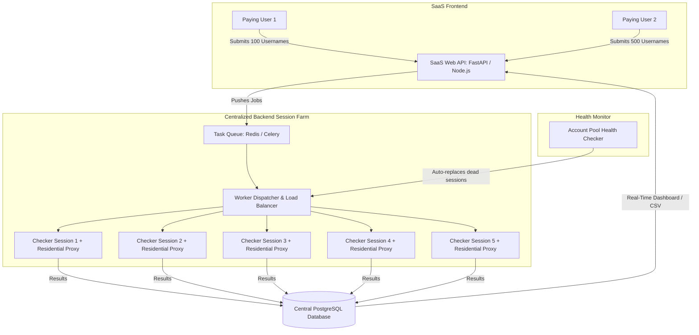

# Deep Technical Feasibility Study: API vs. Browser Automation & SaaS Scaling

## Document: `docs/API_VS_BROWSER_SCALING_FEASIBILITY.md`
**Topic:** Architectural Analysis of Meta Transparency Scraping, Bot Detection, Cost Feasibility, and SaaS Centralized Session Pools.

---

## 1. Executive Comparison: Direct API vs. Playwright vs. Hybrid

| Criteria | Direct Unofficial API (Raw HTTP) | Playwright Browser (Current Approach) | Hybrid Architecture (SaaS Scale) |
| :--- | :--- | :--- | :--- |
| **Official API Support** | **NONE** (Meta Graph API hides country/join date) | **NONE** (Extracts via UI transparency) | **NONE** (Extracts via reverse-engineered GraphQL) |
| **Speed per Request** | Ultra-Fast (~0.3s – 0.8s) | Moderate (~1.5s – 2.5s with asset blocking) | Fast (~0.5s – 1.0s) |
| **Rate-Limit & Ban Risk** | **EXTREME** (Immediate HTTP 429 / checkpoint) | **LOW** (Passes full Chromium browser fingerprint) | **LOW to MODERATE** (Requires TLS spoofing + proxies) |
| **Token Maintenance** | High (Requires dynamic `fb_dtsg`, `jazoest`, `lsd`, `doc_id`) | **Zero** (Browser runtime computes tokens automatically) | Moderate (Headless token harvester refreshes cookies) |
| **RAM / CPU Footprint** | Extremely Low (~50MB per process) | Moderate (~150MB per browser context) | Low to Moderate (~100MB per worker) |
| **Suitability** | **Unstable for production** | **Best for Desktop Tool (Zero Server Cost)** | **Best for Scaled Web SaaS (100k+ accs/day)** |

---

## 2. Why Direct API Fails on Meta (Technical Breakdown)

During prototype benchmarking (`fast_checker.py`), sending direct HTTP requests to Meta transparency endpoints resulted in immediate **`HTTP 429 (Too Many Requests)`** within 2 requests. Meta enforces four layers of enterprise bot protection:

```
[Incoming Direct Request]
          │
          ├── Layer 1: TLS / JA3 Fingerprint Inspection (Akamai Edge)
          │   └── Rejects standard Python requests / aiohttp / cURL cipher suites.
          │
          ├── Layer 2: Dynamic Cryptographic Tokens
          │   └── Demands salted HMAC `fb_dtsg`, session `lsd`, and `jazoest` hashes.
          │
          ├── Layer 3: Dynamic GraphQL `doc_id` Hashing
          │   └── Query IDs rotate frequently during Meta web deployments.
          │
          └── Layer 4: Velocity & Behavior Analytics
              └── Flags accounts performing non-human query cadences (<2s).
```

### Why Playwright Succeeds:
Playwright executes a genuine Chromium browser engine. It naturally passes Layer 1 (genuine TLS handshake), Layer 2 (Meta JavaScript generates valid tokens), and Layer 3 (React bundles fetch the latest `doc_id`). Combined with resource blocking (blocking images/videos) and 5-worker concurrency, it delivers the **safest, most durable desktop architecture**.

---

## 3. Web SaaS Architecture: How Does Login Work for Thousands of Users?

In a Web SaaS platform (e.g., Modash, HypeAuditor), **paying customers NEVER provide their personal Instagram credentials**.

### The Centralized Backend Worker & Session Pool Architecture



### How the Session Pool Operates:
1. **The SaaS Owner maintains a Pool of 20 to 50 Disposable Checker Accounts:**
   - Accounts are bought or created once ($0.50 – $1.00 per aged account).
   - Saved as persistent session tokens in Redis.
2. **Rotating Residential Proxies:**
   - Every worker query is routed through a rotating residential IP (e.g., Bright Data / Webshare / Smartproxy).
   - Meta sees each request originating from a different residential internet connection worldwide.
3. **Automated Health Monitoring:**
   - If a dummy account encounters a checkpoint, the health monitor quarantines it and activates a warm backup account from the pool.
4. **End-User Experience:**
   - End-users visit the website, pay their subscription, upload usernames, and download results. They have **zero awareness** of the backend worker pool.

---

## 4. Scaling Cost & Infrastructure Feasibility Study

| Scale Tier | Daily Volume | Recommended Architecture | Monthly Infrastructure Cost |
| :--- | :--- | :--- | :--- |
| **Tier 1: Desktop App (Current)** | Up to 2,000 accs/day | Desktop Tool + 5 Playwright Workers + Client's Internet | **$0 / month** (Runs locally on client machine) |
| **Tier 2: Small Web SaaS** | 10,000 accs/day | 2 VPS Servers (8GB RAM each) + 15 Checker Accounts + Rotating Proxies (10GB) | **~$60 – $90 / month** |
| **Tier 3: Enterprise SaaS** | 100,000+ accs/day | Distributed Kubernetes Cluster (FastAPI + Hybrid Playwright Token Harvester) + 50 Accounts + Proxy Pool | **~$250 – $400 / month** |

### Profitability Model for SaaS:
- If 30 customers pay **$49 / month** = **$1,470 / month revenue**.
- Total Tier 2 infrastructure cost = **~$80 / month**.
- **Net Profit Margin:** **>90%**.
