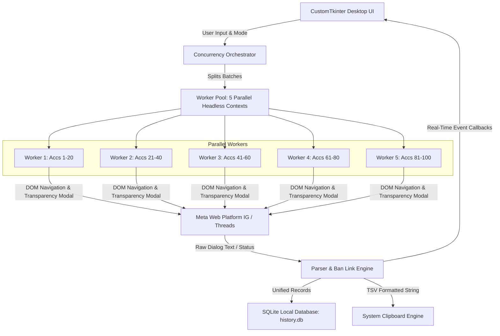

# System Architecture & Technical Specifications

## Document: `docs/architecture.md`
**Project:** MetaInspector Desktop (Instagram & Threads Checker)  
**Architecture Style:** Desktop GUI with Multi-Worker Parallel Headless Browser Engine  

---

## 1. High-Level System Architecture



---

## 2. Multi-Worker Concurrency Model (100 Accs in 4–5 Mins)

### 2.1 The Throughput Problem
- Sequential checking in 1 browser session requires ~12 seconds per account:
  $$100 \text{ accounts} \times 12\text{s} = 1200\text{s} \approx 20 \text{ minutes}$$
- Attempting high-frequency direct API requests on a single session triggers Meta's `HTTP 429 (Rate Limit)` (as validated during prototype testing).

### 2.2 The 5-Worker Solution
To achieve the 3.0-second effective throughput safely without triggering rate limits:
- The `Concurrency Orchestrator` opens **1 persistent Browser Context with 5 pages** (not 5 isolated contexts as originally planned — only one persistent context can hold the logged-in checker session, so every worker page must share it; see `src/core/scraper.py` `MultiWorkerScraper._open_pages`).
- The input username list is partitioned into 5 balanced chunks:
  $$\text{Chunk Size} = \frac{N}{5} = \frac{100}{5} = 20 \text{ accounts per worker}$$
- Each worker processes its 20 accounts concurrently with safe human-like delays (8–12 seconds per profile).
- **Total Duration:**
  $$\text{Execution Time} = 20 \text{ accounts} \times 12\text{s} = 240\text{s} = \mathbf{4.0 \text{ minutes}} \quad (\checkmark < 5 \text{ mins})$$

---

## 3. Resource Optimization & Latency Reduction

To minimize page loading latency from 2.5s to <0.5s per profile, each Playwright worker context registers a network route interceptor that aborts heavy media assets:

```python
# Abort images, media, and third-party trackers to maximize speed
def attach_resource_blocker(page):
    page.route(
        "**/*.{png,jpg,jpeg,webp,gif,mp4,webm,woff,woff2,ttf,otf}",
        lambda route: route.abort()
    )
```

Only essential HTML documents, JavaScript scripts, and GraphQL transparency XHR/Fetch payloads are transferred.

---

## 4. Cross-Platform Ban Linking Engine

The Ban Linking Engine merges platform results using the following rule set. **Updated 2026-10-07** to match the actual implementation in `src/core/ban_engine.py`: a checkpoint/challenge on *our own checker session* (`session_blocked`) is deliberately excluded from the banned-states check and reported as `BLOCKED` instead of `BANNED` — otherwise a challenge on our checker account would falsely mark every target account as banned (see `docs/memory.md` §3.2, deviation #1).

```python
class BanLinkEngine:
    BANNED_STATES = {"banned", "suspended", "checkpoint", "deactivated"}

    @classmethod
    def evaluate(cls, ig_status: str, threads_status: str) -> dict:
        ig = cls.normalize(ig_status)
        threads = cls.normalize(threads_status)

        # If either platform is banned, both are marked BANNED
        if ig in cls.BANNED_STATES or threads in cls.BANNED_STATES:
            return {"composite_status": "BANNED", "ig_status": "banned", "threads_status": "banned"}

        # The checker's OWN session was challenged — nothing about the target
        # account can be trusted, so this must never be reported as a ban.
        if "session_blocked" in (ig, threads):
            return {"composite_status": "BLOCKED", "ig_status": ig, "threads_status": threads}

        checked = [s for s in (ig, threads) if s != "skipped"]
        if checked and all(s == "not_found" for s in checked):
            return {"composite_status": "NOT_FOUND", "ig_status": ig, "threads_status": threads}

        if any(s in ("active", "private") for s in checked):
            return {"composite_status": "ACTIVE", "ig_status": ig, "threads_status": threads}

        return {"composite_status": "ERROR", "ig_status": ig, "threads_status": threads}
```

---

## 5. Database Schema (`history.db`)

An embedded SQLite database provides persistent storage for all execution runs:

### Table: `runs`
| Column | Type | Description |
| :--- | :--- | :--- |
| `run_id` | TEXT PRIMARY KEY | UUID or timestamp identifier (e.g., `RUN_20261004_193000`) |
| `created_at` | DATETIME | Timestamp when run started |
| `mode` | TEXT | `ig_only`, `threads_only`, or `combined` |
| `total_accounts` | INTEGER | Total count of submitted usernames |
| `active_count` | INTEGER | Accounts verified as active |
| `banned_count` | INTEGER | Accounts flagged as banned |
| `duration_seconds` | REAL | Total run runtime |

### Table: `run_items`
| Column | Type | Description |
| :--- | :--- | :--- |
| `id` | INTEGER PRIMARY KEY AUTOINCREMENT | Unique row identifier |
| `run_id` | TEXT | Foreign Key pointing to `runs.run_id` |
| `username` | TEXT | Target account username |
| `composite_status` | TEXT | Final resolved status (`ACTIVE`, `BANNED`, etc.) |
| `ig_country` | TEXT | Extracted Instagram country location |
| `ig_date_joined` | TEXT | Extracted Instagram registration date |
| `threads_country` | TEXT | Extracted Threads country location |
| `threads_date_joined` | TEXT | Extracted Threads registration date |
| `threads_badge` | TEXT | Extracted signup badge sequence |
| `error_message` | TEXT | Failure diagnostic message if any |

---

## 6. Clipboard Engine (Google Sheets Integration)

Data is formatted into clean Tab-Separated Values (TSV) strings with a standard header row:

```tsv
Username\tStatus\tIG Country\tIG Date Joined\tThreads Country\tThreads Date Joined
username1\tACTIVE\tTurkey\tSeptember 2026\tTurkey\tSeptember 2026
username2\tBANNED\tN/A\tN/A\tN/A\tN/A
```

When copied into the Windows clipboard with MIME type `text/plain` using tab separators, pressing `Ctrl + V` in Google Sheets automatically distributes every field into separate cells without extra formatting.

---

## 7. Security & Session Encapsulation

1. **Zero Plaintext Credentials:** The desktop tool never requests, prompts, or stores account passwords.
2. **Encapsulated Profile Directory:** User sessions are stored inside a dedicated local profile directory (`browser_profile/`).
3. **In-App Setup Mode:** Launches the official Meta authentication pages directly in Chromium for one-time manual login by the user.
